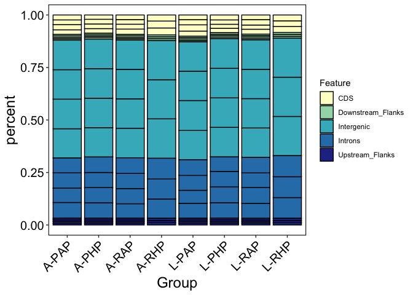

Methylation\_Characterization
================
Author: Kevin Wong; <kevinhwong1@gmail.com>

# Install packages

``` r
require(RColorBrewer)
require(dichromat)
require(compositions)
require(vegan)
require(cluster)
require(dplyr)
require(tibble)
require(tidyr)
require(ggplot2)
require(lme4)
require(RColorBrewer)
require(Rmisc)
```

# Import metadata

``` r
metadata <- read.csv("../data/metadata/Thermal_Transplant_Metadata_Analysis.csv")

#Selecting adult-larval pair samples
metadata_select <- metadata %>% 
  filter(Transplant != "Rim") %>%
  filter(Coral.ID != "R-14-A") %>%
  select(-Timepoint, -File_Name)

metadata_select2 <- metadata %>% 
  filter(Transplant != "Rim") %>%
  filter(Coral.ID != "R-14-A") %>%
  select(-Timepoint)
```

# CpG methylation status

### Import file counts

``` r
PastAll <- read.table("../output/WGBS/genome_feature_20221017/Past-5x-bedgraph-counts.txt", header = FALSE, col.names = c("totalLines", "filename")) #Import file using space as a delimiter. Columns are the number of lines and the filename
PastAll <- PastAll[-48,] #Remove last row (total lines for all files)
tail(PastAll) #Confirm import
```

    ##    totalLines                                     filename
    ## 42    6156923 coverage_files/L-661_S182_5x_sorted.bedgraph
    ## 43    6763146 coverage_files/L-704_S169_5x_sorted.bedgraph
    ## 44    2165197 coverage_files/L-728_S161_5x_sorted.bedgraph
    ## 45    4272213 coverage_files/L-862_S200_5x_sorted.bedgraph
    ## 46    5074266 coverage_files/L-924_S204_5x_sorted.bedgraph
    ## 47    6627315 coverage_files/L-933_S203_5x_sorted.bedgraph

``` r
PastMeth <- read.table("../output/WGBS/genome_feature_20221017/Past-5x-Meth-counts.txt", header = FALSE, col.names = c("Meth", "filename")) #Import file using space as a delimiter. Columns are the number of lines and the filename
PastMeth <- PastMeth[-48,] #Remove last row (total lines for all files)

PastMeth$filename <- gsub("_5x_sorted.bedgraph-Meth","",PastMeth$filename) #remove extra characters
PastMeth$filename <- gsub("_....","",PastMeth$filename) #remove extra characters

tail(PastMeth) #Confirm import
```

    ##      Meth filename
    ## 42 428486    L-661
    ## 43 537188    L-704
    ## 44 138893    L-728
    ## 45 326434    L-862
    ## 46 305240    L-924
    ## 47 433030    L-933

``` r
PastSparseMeth <- read.table("../output/WGBS/genome_feature_20221017/Past-5x-sparseMeth-counts.txt", header = FALSE, col.names = c("sparseMeth", "filename")) #Import file using space as a delimiter. Columns are the number of lines and the filename
PastSparseMeth <- PastSparseMeth[-48,] #Remove last row (total lines for all files)
tail(PastSparseMeth) #Confirm import
```

    ##    sparseMeth                                 filename
    ## 42     301901 L-661_S182_5x_sorted.bedgraph-sparseMeth
    ## 43     367899 L-704_S169_5x_sorted.bedgraph-sparseMeth
    ## 44     167990 L-728_S161_5x_sorted.bedgraph-sparseMeth
    ## 45     201939 L-862_S200_5x_sorted.bedgraph-sparseMeth
    ## 46     258218 L-924_S204_5x_sorted.bedgraph-sparseMeth
    ## 47     297578 L-933_S203_5x_sorted.bedgraph-sparseMeth

``` r
PastUnMeth <- read.table("../output/WGBS/genome_feature_20221017/Past-5x-unMeth-counts.txt", header = FALSE, col.names = c("unMeth", "filename")) #Import file using space as a delimiter. Columns are the number of lines and the filename
PastUnMeth <- PastUnMeth[-48,] #Remove last row (total lines for all files)
tail(PastUnMeth) #Confirm import
```

    ##     unMeth                             filename
    ## 42 5426536 L-661_S182_5x_sorted.bedgraph-unMeth
    ## 43 5858059 L-704_S169_5x_sorted.bedgraph-unMeth
    ## 44 1858314 L-728_S161_5x_sorted.bedgraph-unMeth
    ## 45 3743840 L-862_S200_5x_sorted.bedgraph-unMeth
    ## 46 4510808 L-924_S204_5x_sorted.bedgraph-unMeth
    ## 47 5896707 L-933_S203_5x_sorted.bedgraph-unMeth

### Create summary table

``` r
PastCpGType <- cbind(PastAll, PastMeth, PastSparseMeth, PastUnMeth) #Mash tables together by column
rownames(PastCpGType) <- substr(PastMeth$filename, start = 1, stop = 6) #Use the first 6 characters of the filename to add sample ID as row names
PastCpGType <- PastCpGType[,-c(2,4,6,8)] #Remove filename columns
tail(PastCpGType) #Confirm table mashing
```

    ##       totalLines   Meth sparseMeth  unMeth
    ## L-661    6156923 428486     301901 5426536
    ## L-704    6763146 537188     367899 5858059
    ## L-728    2165197 138893     167990 1858314
    ## L-862    4272213 326434     201939 3743840
    ## L-924    5074266 305240     258218 4510808
    ## L-933    6627315 433030     297578 5896707

``` r
PastCpGType$percentMeth <- (PastCpGType$Meth / PastCpGType$totalLines) * 100 #Calculate percent methylated loci
PastCpGType$percentSparseMeth <- (PastCpGType$sparseMeth / PastCpGType$totalLines) * 100 #Calculate percent sparsely methylated loci
PastCpGType$percentUnMeth <- (PastCpGType$unMeth / PastCpGType$totalLines) * 100 #Calculate percent unmethylated loci
PastCpGType <- PastCpGType[,c(1, 2, 5, 3, 6, 4, 7)] #Reorganize columns
tail(PastCpGType) #Confirm calculations
```

    ##       totalLines   Meth percentMeth sparseMeth percentSparseMeth  unMeth
    ## L-661    6156923 428486    6.959418     301901          4.903440 5426536
    ## L-704    6763146 537188    7.942872     367899          5.439761 5858059
    ## L-728    2165197 138893    6.414797     167990          7.758647 1858314
    ## L-862    4272213 326434    7.640864     201939          4.726801 3743840
    ## L-924    5074266 305240    6.015451     258218          5.088775 4510808
    ## L-933    6627315 433030    6.534019     297578          4.490174 5896707
    ##       percentUnMeth
    ## L-661      88.13714
    ## L-704      86.61737
    ## L-728      85.82656
    ## L-862      87.63233
    ## L-924      88.89577
    ## L-933      88.97581

``` r
write.table(PastCpGType, "../output/WGBS/genome_feature_20221017/Past-CpG-Type.txt", sep = "\t", quote = FALSE, row.names = TRUE) #Save summary table
```

### Merge with metdata

``` r
PastCpGType2 <- tibble::rownames_to_column(PastCpGType, "Sample.ID")

PastCpGType3 <- merge(metadata_select, PastCpGType2, by = "Sample.ID")
```

Figure out what to plot for this

# CpG genomic location

### Import file counts and clean/prepare files for merge

``` r
PastGenomeFeatures <- read.table("../output/WGBS/genome_feature_20221017/Past-CGMotif-Overlaps-counts.txt", header = FALSE, col.names = c("counts", "filename")) #Import file with CG motif and feature track overlaps
PastGenomeFeatures <- PastGenomeFeatures[-c(8:9),] #Remove final row
tail(PastGenomeFeatures) #Check import
```

    ##     counts                                    filename
    ## 2        0 Past-CGMotif-Flanks-Downstream-Overlaps.txt
    ## 3  3041507            Past-CGMotif-Flanks-Overlaps.txt
    ## 4  1680722   Past-CGMotif-Flanks-Upstream-Overlaps.txt
    ## 5  7551011              Past-CGMotif-Gene-Overlaps.txt
    ## 6 18128757        Past-CGMotif-Intergenic-Overlaps.txt
    ## 7  5649303            Past-CGMotif-Intron-Overlaps.txt

``` r
PastGeneOverlaps <- read.table("../output/WGBS/genome_feature_20221017/Past-5x-paGenes-counts.txt", header = FALSE, col.names = c("counts", "filename")) #Import file with all file-gene overlaps
PastGeneOverlaps <- PastGeneOverlaps[-189,] #Remove final row
tail(PastGeneOverlaps) #Confirm import
```

    ##      counts                                             filename
    ## 183  106038 L-924_S204_5x_sorted.bedgraph-sparseMeth.bed-paGenes
    ## 184 1769440     L-924_S204_5x_sorted.bedgraph-unMeth.bed-paGenes
    ## 185 2666083            L-933_S203_5x_sorted.bedgraph.bed-paGenes
    ## 186  269011       L-933_S203_5x_sorted.bedgraph-Meth.bed-paGenes
    ## 187  120153 L-933_S203_5x_sorted.bedgraph-sparseMeth.bed-paGenes
    ## 188 2276919     L-933_S203_5x_sorted.bedgraph-unMeth.bed-paGenes

``` r
Meth_Status<-rep(c("All_CpGs","Methylated","Sparsely_Methylated","Unmethylated"),times=47)

PastGeneOverlaps$Meth_Status <- Meth_Status
PastGeneOverlaps$filename <- gsub("\\_..*","",PastGeneOverlaps$filename)
PastGeneOverlaps$Feature <- "Gene"

colnames(PastGeneOverlaps)[2] <- "Sample.ID"
```

``` r
PastCDSOverlaps <- read.table("../output/WGBS/genome_feature_20221017/Past-5x-paCDS-counts.txt", header = FALSE, col.names = c("counts", "filename")) #Import file with all file-CDS overlaps
PastCDSOverlaps <- PastCDSOverlaps[-189,] #Remove final row
tail(PastCDSOverlaps) #Confirm import
```

    ##     counts                                           filename
    ## 183  30611 L-924_S204_5x_sorted.bedgraph-sparseMeth.bed-paCDS
    ## 184 585454     L-924_S204_5x_sorted.bedgraph-unMeth.bed-paCDS
    ## 185 780408            L-933_S203_5x_sorted.bedgraph.bed-paCDS
    ## 186  62483       L-933_S203_5x_sorted.bedgraph-Meth.bed-paCDS
    ## 187  30111 L-933_S203_5x_sorted.bedgraph-sparseMeth.bed-paCDS
    ## 188 687814     L-933_S203_5x_sorted.bedgraph-unMeth.bed-paCDS

``` r
PastCDSOverlaps$Meth_Status <- Meth_Status
PastCDSOverlaps$filename <- gsub("\\_..*","",PastCDSOverlaps$filename)
PastCDSOverlaps$Feature <- "CDS"

colnames(PastCDSOverlaps)[2] <- "Sample.ID"
```

``` r
PastIntronsOverlaps <- read.table("../output/WGBS/genome_feature_20221017/Past-5x-paIntrons-counts.txt", header = FALSE, col.names = c("counts", "filename")) #Import file with all file-Introns overlaps
PastIntronsOverlaps <- PastIntronsOverlaps[-189,] #Remove final row
tail(PastIntronsOverlaps) #Confirm import
```

    ##      counts                                               filename
    ## 183   75570 L-924_S204_5x_sorted.bedgraph-sparseMeth.bed-paIntrons
    ## 184 1172701     L-924_S204_5x_sorted.bedgraph-unMeth.bed-paIntrons
    ## 185 1875139            L-933_S203_5x_sorted.bedgraph.bed-paIntrons
    ## 186  209484       L-933_S203_5x_sorted.bedgraph-Meth.bed-paIntrons
    ## 187   90199 L-933_S203_5x_sorted.bedgraph-sparseMeth.bed-paIntrons
    ## 188 1575456     L-933_S203_5x_sorted.bedgraph-unMeth.bed-paIntrons

``` r
PastIntronsOverlaps$Meth_Status <- Meth_Status
PastIntronsOverlaps$filename <- gsub("\\_..*","",PastIntronsOverlaps$filename)
PastIntronsOverlaps$Feature <- "Introns"

colnames(PastIntronsOverlaps)[2] <- "Sample.ID"
```

``` r
PastFlanksOverlaps <- read.table("../output/WGBS/genome_feature_20221017/Past-5x-paFlanks-counts.txt", header = FALSE, col.names = c("counts", "filename")) #Import file with all file-flank overlaps
PastFlanksOverlaps <- PastFlanksOverlaps[-189,] #Remove final row
tail(PastFlanksOverlaps) #Confirm import
```

    ##      counts                                              filename
    ## 183   37248 L-924_S204_5x_sorted.bedgraph-sparseMeth.bed-paFlanks
    ## 184  721100     L-924_S204_5x_sorted.bedgraph-unMeth.bed-paFlanks
    ## 185 1010890            L-933_S203_5x_sorted.bedgraph.bed-paFlanks
    ## 186   40491       L-933_S203_5x_sorted.bedgraph-Meth.bed-paFlanks
    ## 187   41872 L-933_S203_5x_sorted.bedgraph-sparseMeth.bed-paFlanks
    ## 188  928527     L-933_S203_5x_sorted.bedgraph-unMeth.bed-paFlanks

``` r
PastFlanksOverlaps$Meth_Status <- Meth_Status
PastFlanksOverlaps$filename <- gsub("\\_..*","",PastFlanksOverlaps$filename)
PastFlanksOverlaps$Feature <- "All_Flanks"

colnames(PastFlanksOverlaps)[2] <- "Sample.ID"
```

``` r
PastFlanksUpstreamOverlaps <- read.table("../output/WGBS/genome_feature_20221017/Past-5x-paFlanksUpstream-counts.txt", header = FALSE, col.names = c("counts", "filename")) #Import file with all file-upstream flank overlaps
PastFlanksUpstreamOverlaps <- PastFlanksUpstreamOverlaps[-189,] #Remove final row
tail(PastFlanksUpstreamOverlaps) #Confirm import
```

    ##     counts                                                      filename
    ## 183  20752 L-924_S204_5x_sorted.bedgraph-sparseMeth.bed-paFlanksUpstream
    ## 184 409232     L-924_S204_5x_sorted.bedgraph-unMeth.bed-paFlanksUpstream
    ## 185 566318            L-933_S203_5x_sorted.bedgraph.bed-paFlanksUpstream
    ## 186  21331       L-933_S203_5x_sorted.bedgraph-Meth.bed-paFlanksUpstream
    ## 187  23124 L-933_S203_5x_sorted.bedgraph-sparseMeth.bed-paFlanksUpstream
    ## 188 521863     L-933_S203_5x_sorted.bedgraph-unMeth.bed-paFlanksUpstream

``` r
PastFlanksUpstreamOverlaps$Meth_Status <- Meth_Status
PastFlanksUpstreamOverlaps$filename <- gsub("\\_..*","",PastFlanksUpstreamOverlaps$filename)
PastFlanksUpstreamOverlaps$Feature <- "Upstream_Flanks"

colnames(PastFlanksUpstreamOverlaps)[2] <- "Sample.ID"
```

``` r
# PastFlanksDownstreamOverlaps <- read.table("../output/WGBS/genome_feature_20221017/Past-5x-paFlanksDownstream-counts.txt", header = FALSE, col.names = c("counts", "filename")) #Import file with all file-Introns overlaps
# PastFlanksUpstreamOverlaps <- PastFlanksUpstreamOverlaps[-189,] #Remove final row
# tail(PastFlanksDownstreamOverlaps) #Confirm import
```

``` r
PastIntergenicOverlaps <- read.table("../output/WGBS/genome_feature_20221017/Past-5x-paIntergenic-counts.txt", header = FALSE, col.names = c("counts", "filename")) #Import file with all file-Intergenic overlaps
PastIntergenicOverlaps <- PastIntergenicOverlaps[-189,] #Remove final row
tail(PastIntergenicOverlaps) #Confirm import
```

    ##      counts                                                  filename
    ## 183  221003 L-924_S204_5x_sorted.bedgraph-sparseMeth.bed-paIntergenic
    ## 184 3790447     L-924_S204_5x_sorted.bedgraph-unMeth.bed-paIntergenic
    ## 185 5617463            L-933_S203_5x_sorted.bedgraph.bed-paIntergenic
    ## 186  392592       L-933_S203_5x_sorted.bedgraph-Meth.bed-paIntergenic
    ## 187  255745 L-933_S203_5x_sorted.bedgraph-sparseMeth.bed-paIntergenic
    ## 188 4969126     L-933_S203_5x_sorted.bedgraph-unMeth.bed-paIntergenic

``` r
PastIntergenicOverlaps$Meth_Status <- Meth_Status
PastIntergenicOverlaps$filename <- gsub("\\_..*","",PastIntergenicOverlaps$filename)
PastIntergenicOverlaps$Feature <- "Intergenic"

colnames(PastIntergenicOverlaps)[2] <- "Sample.ID"
```

### Bind datasets together, calculate downstream flanks, calculate percentage add metadata

``` r
#Bind datasets together
cpg_gf_meth <- rbind(PastGeneOverlaps, PastCDSOverlaps, PastIntronsOverlaps, PastFlanksOverlaps, PastFlanksUpstreamOverlaps, PastIntergenicOverlaps)

#Calculate downstream flanks (All flanks - upstream)
cpg_gf_meth2 <- cpg_gf_meth %>% pivot_wider(names_from = Feature, values_from = counts)
cpg_gf_meth2$Downstream_Flanks <- cpg_gf_meth2$All_Flanks - cpg_gf_meth2$Upstream_Flanks

#Convert back to long format, this is just counts
cpg_gf_meth3 <- cpg_gf_meth2 %>% pivot_longer(!(c(Sample.ID, Meth_Status)), names_to = "Feature", values_to = "counts")

#Calculate percentages 
cpg_gf_meth4 <- cpg_gf_meth2 %>% select(-Gene, -All_Flanks) #remove gene and total flank rows
cpg_gf_meth4[,c(3:7)] <- round((cpg_gf_meth4[,c(3:7)]/rowSums(cpg_gf_meth4[,c(3:7)]))*100,2) # calculating percentages 

#Convert back to long format, this is just percents
cpg_gf_meth5 <- cpg_gf_meth4 %>% pivot_longer(!(c(Sample.ID, Meth_Status)), names_to = "Feature", values_to = "percent")


#adding metadata and saving
cpg_gf_meth_counts <- merge(cpg_gf_meth3, metadata_select, by = "Sample.ID")
write.table(cpg_gf_meth_counts, "../output/WGBS/genome_feature_20221017/Past-Genomic-Location-Counts.txt", sep = "\t", quote = FALSE, row.names = TRUE) #Save file
nrow(cpg_gf_meth_counts)
```

    ## [1] 840

``` r
cpg_gf_meth_percent <- merge(cpg_gf_meth5, metadata_select, by = "Sample.ID")
write.table(cpg_gf_meth_percent, "../output/WGBS/genome_feature_20221017/Past-Genomic-Location-Percent.txt", sep = "\t", quote = FALSE, row.names = TRUE) #Save file
nrow(cpg_gf_meth_percent)
```

    ## [1] 600

Double checking the correct number of rows:

counts: 30 samples x 4 meth statuses x 7 genomic features = 840

percent: 30 samples x 4 meth statuses x 5 genomic features = 600

PERFECT\!

# Plotting with Barcharts and Statistics

``` r
# Plotting just methylated cpgs

Meth_cpg_gf_meth_percent <- cpg_gf_meth_percent %>% filter(Meth_Status == "Methylated")

Meth_Percent_box<- ggplot(Meth_cpg_gf_meth_percent, aes(x=LifeStage, y=percent, color = Treatment, fill = Group)) +
  geom_boxplot(width=.5, outlier.shape= NA, position = position_dodge(width = 0.5), alpha = 0.7) +
#  stat_summary(fun=mean, geom="line", aes(group=Group, color = Treatment), position = position_dodge(width = 0.5))  + 
#  geom_point(pch = 21, position=position_jitterdodge(), outlier.shape= NA) +
  scale_colour_manual(values=c("#00a2ff", "#ff5d00")) +
  scale_fill_manual(values=c("white", "white", "#00a2ff", "#ff5d00", "white", "white", "#00a2ff", "#ff5d00")) +
  theme_bw() + 
  theme(panel.border = element_rect(color="black", fill=NA, size=0.75), 
        panel.grid.major = element_blank(),
        panel.grid.minor = element_blank(), axis.line = element_blank()) +
  theme(axis.text = element_text(size = 15, color = "black"),
        axis.title = element_text(size = 18, color = "black")) +
  facet_wrap(~ Feature, scales = "free")

Meth_Percent_box
```

<!-- -->

``` r
# Statistics

## No need for random effects because when I ran the mixed effect model with random effects, it gave the singularity warning meaning there is minimal random effects

### CDS
CDS_meth <- Meth_cpg_gf_meth_percent %>% filter(Feature == "CDS")
CDS_meth_model <- aov(percent~Origin*Treatment*LifeStage, data = CDS_meth)

# qqnorm(resid(CDS_meth_model))
# #qqline(resid(CDS_meth_model)) # double check normality
# 
# boxplot(resid(CDS_meth_model)~CDS_meth$Origin)
# boxplot(resid(CDS_meth_model)~CDS_meth$Treatment)
# boxplot(resid(CDS_meth_model)~CDS_meth$LifeStage)
summary(CDS_meth_model)
```

    ##                            Df Sum Sq Mean Sq F value Pr(>F)  
    ## Origin                      1  0.021   0.021   0.036 0.8510  
    ## Treatment                   1  3.719   3.719   6.336 0.0196 *
    ## LifeStage                   1  0.087   0.087   0.149 0.7032  
    ## Origin:Treatment            1  1.069   1.069   1.820 0.1910  
    ## Origin:LifeStage            1  1.436   1.436   2.446 0.1321  
    ## Treatment:LifeStage         1  2.217   2.217   3.776 0.0649 .
    ## Origin:Treatment:LifeStage  1  0.000   0.000   0.000 1.0000  
    ## Residuals                  22 12.915   0.587                 
    ## ---
    ## Signif. codes:  0 '***' 0.001 '**' 0.01 '*' 0.05 '.' 0.1 ' ' 1

``` r
capture.output(summary(CDS_meth_model), file = "../output/WGBS/genome_feature_20221017/Statistics/CDS_Meth_aov.csv")

### Downstream Flanks
DF_meth <- Meth_cpg_gf_meth_percent %>% filter(Feature == "Downstream_Flanks")
DF_meth_model <- aov(percent~Origin*Treatment*LifeStage, data = DF_meth)

# qqnorm(resid(DF_meth_model))
# #qqline(resid(DF_meth_model)) # double check normality
# 
# boxplot(resid(DF_meth_model)~DF_meth$Origin)
# boxplot(resid(DF_meth_model)~DF_meth$Treatment)
# boxplot(resid(DF_meth_model)~DF_meth$LifeStage)
summary(DF_meth_model)
```

    ##                            Df  Sum Sq  Mean Sq F value  Pr(>F)   
    ## Origin                      1 0.02136 0.021357   8.604 0.00769 **
    ## Treatment                   1 0.00114 0.001143   0.460 0.50449   
    ## LifeStage                   1 0.00033 0.000333   0.134 0.71753   
    ## Origin:Treatment            1 0.00395 0.003949   1.591 0.22040   
    ## Origin:LifeStage            1 0.00004 0.000037   0.015 0.90367   
    ## Treatment:LifeStage         1 0.00129 0.001289   0.519 0.47872   
    ## Origin:Treatment:LifeStage  1 0.00027 0.000270   0.109 0.74487   
    ## Residuals                  22 0.05461 0.002482                   
    ## ---
    ## Signif. codes:  0 '***' 0.001 '**' 0.01 '*' 0.05 '.' 0.1 ' ' 1

``` r
capture.output(summary(DF_meth_model), file = "../output/WGBS/genome_feature_20221017/Statistics/DF_Meth_aov.csv")
```

``` r
# Plotting all cpgs

All_cpg_gf_meth_percent <- cpg_gf_meth_percent %>% filter(Meth_Status == "All_CpGs")

All_Percent<- ggplot(All_cpg_gf_meth_percent, aes(x=LifeStage, y=percent, color = Treatment, fill = Group)) +
  geom_boxplot(width=.5, outlier.shape= NA, position = position_dodge(width = 0.5), alpha = 0.7) +
#  stat_summary(fun=mean, geom="line", aes(group=Group, color = Treatment), position = position_dodge(width = 0.5))  + 
#  geom_point(pch = 21, position=position_jitterdodge(), outlier.shape= NA) +
  scale_colour_manual(values=c("#00a2ff", "#ff5d00")) +
  scale_fill_manual(values=c("white", "white", "#00a2ff", "#ff5d00", "white", "white", "#00a2ff", "#ff5d00")) +
  theme_bw() + 
  theme(panel.border = element_rect(color="black", fill=NA, size=0.75), 
        panel.grid.major = element_blank(),
        panel.grid.minor = element_blank(), axis.line = element_blank()) +
  theme(axis.text = element_text(size = 15, color = "black"),
        axis.title = element_text(size = 18, color = "black"), 
        legend.position="none") +
  facet_wrap(~ Feature, scales = "free")

All_Percent
```

<!-- -->

``` r
#plotting stacked barchart (all)

Meth_Percent_bar <- ggplot(Meth_cpg_gf_meth_percent, aes(fill=Feature, y=percent, x=Group)) + 
  geom_bar(position="fill", stat="identity", color = "black") +
  scale_fill_brewer(palette = "YlGnBu") +
  theme_bw() + 
  theme(panel.border = element_rect(color="black", fill=NA, size=0.75), 
        panel.grid.major = element_blank(),
        panel.grid.minor = element_blank(), axis.line = element_blank()) +
  theme(axis.text = element_text(size = 15, color = "black"),
        axis.title = element_text(size = 18, color = "black"), 
        axis.text.x = element_text(angle = 45, hjust=1))

Meth_Percent_bar
```

<!-- -->

``` r
#plotting stacked barchart (means)

Meth_cpg_gf_meth_percent_mean <- summarySE(Meth_cpg_gf_meth_percent, measurevar="percent", groupvars=c("Group", "Feature"))

Meth_Percent_bar <- ggplot(Meth_cpg_gf_meth_percent_mean, aes(fill=Feature, y=percent, x=Group)) + 
  geom_bar(position="fill", stat="identity", color = "black") +
  scale_fill_brewer(palette = "YlGnBu") +
  theme_bw() + 
  theme(panel.border = element_rect(color="black", fill=NA, size=0.75), 
        panel.grid.major = element_blank(),
        panel.grid.minor = element_blank(), axis.line = element_blank()) +
  theme(axis.text = element_text(size = 15, color = "black"),
        axis.title = element_text(size = 18, color = "black"), 
        axis.text.x = element_text(angle = 45, hjust=1))

Meth_Percent_bar
```

<!-- -->
