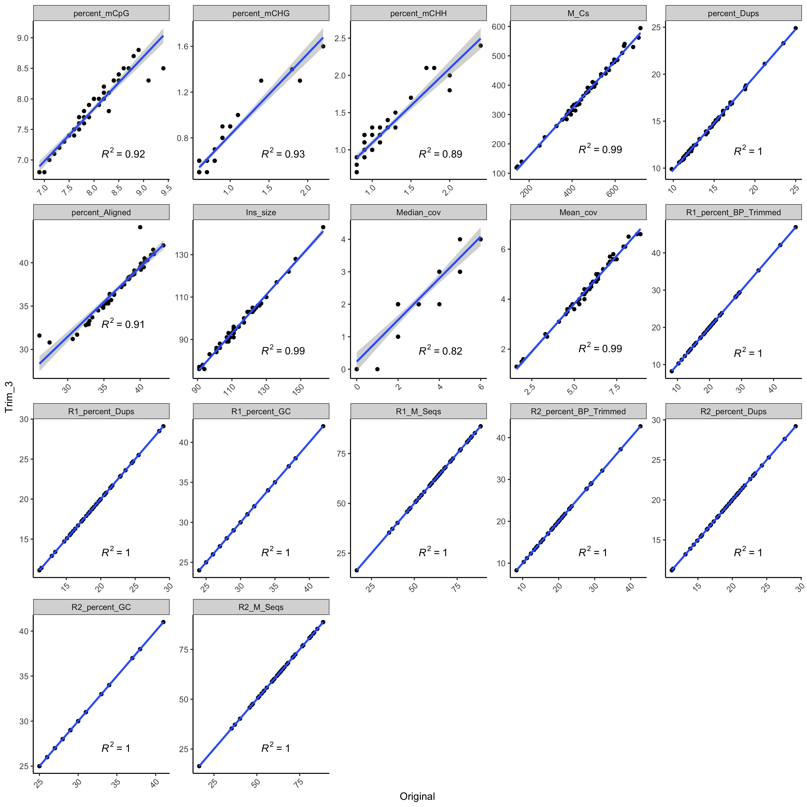
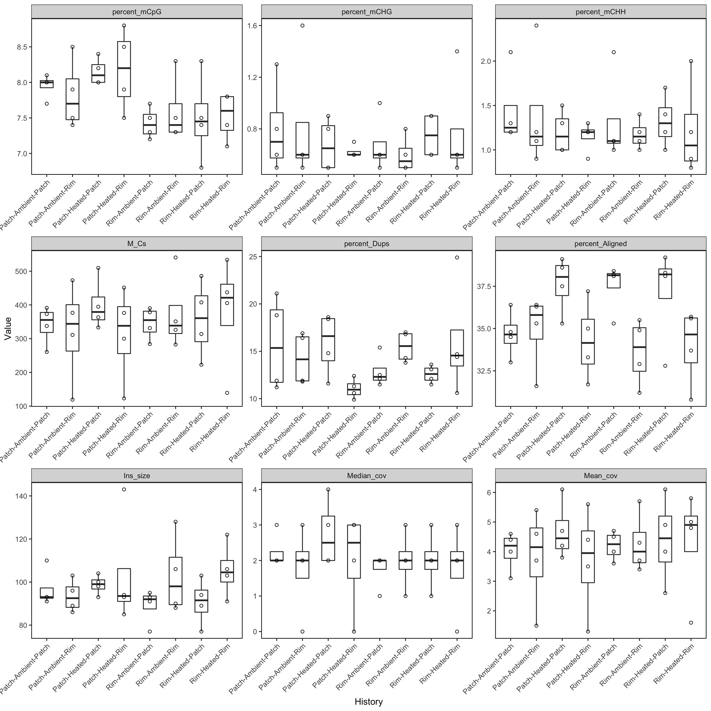
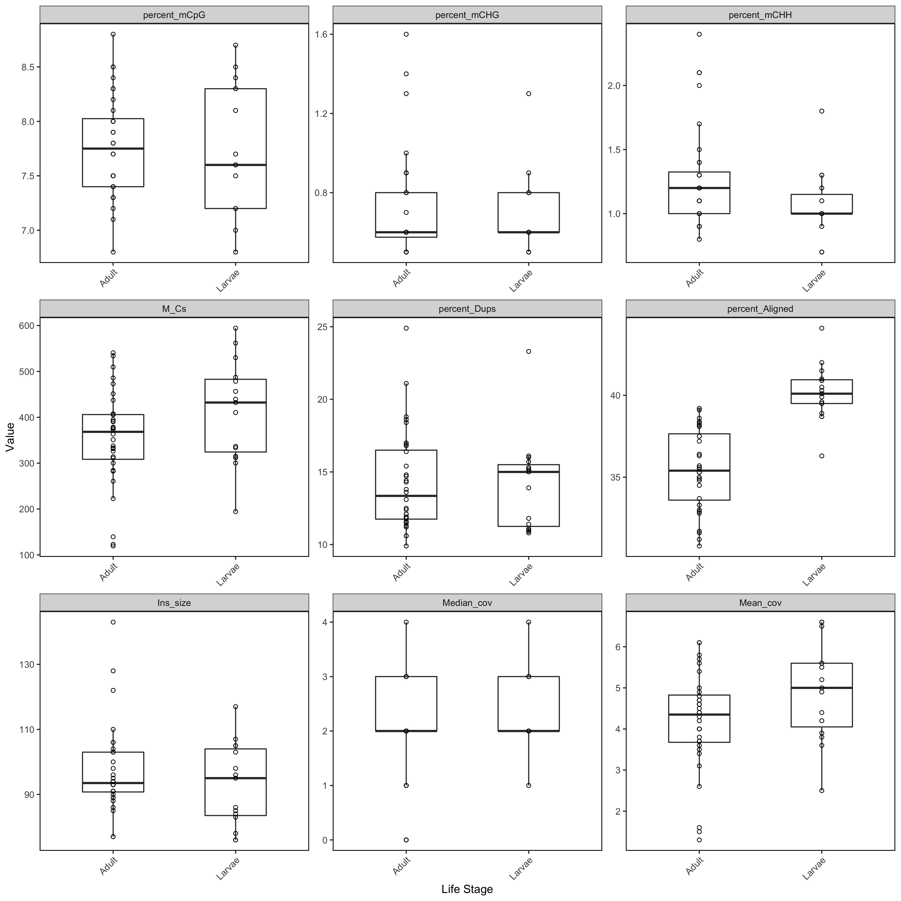
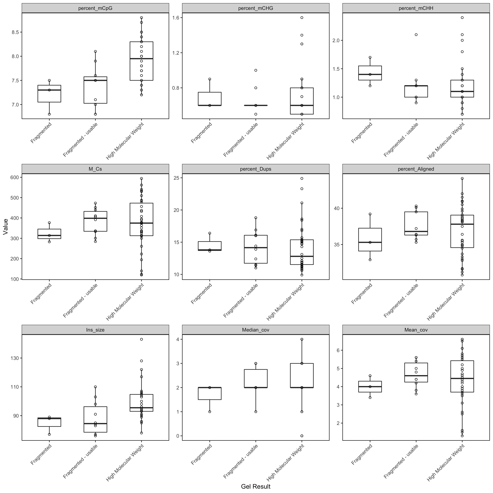
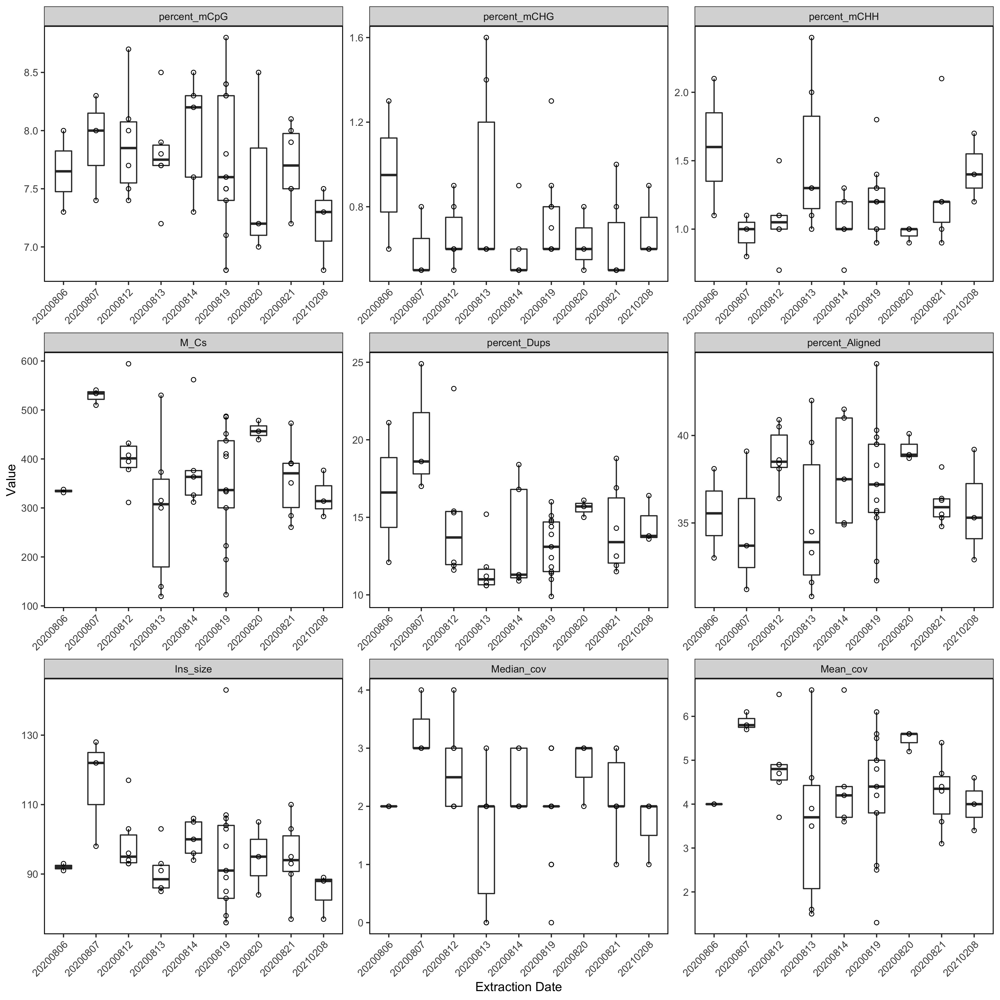
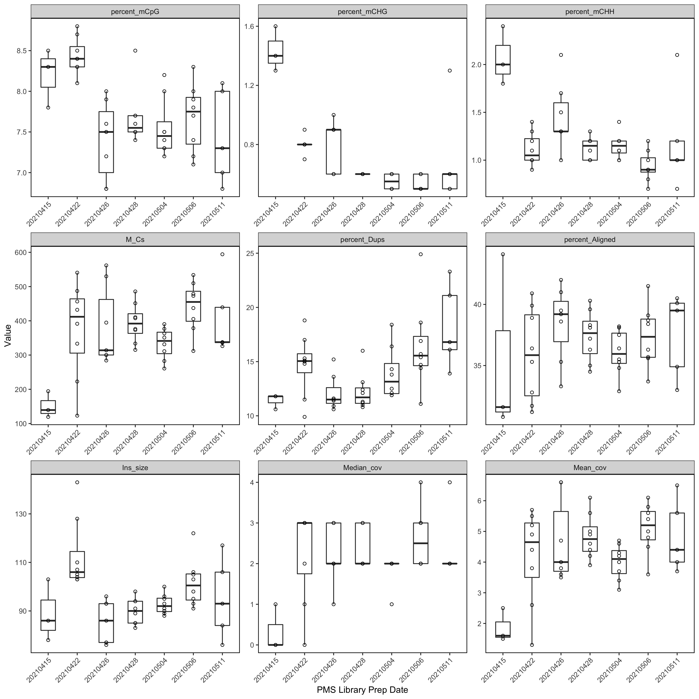

```{r setup, include=FALSE}
knitr::opts_chunk$set(echo = TRUE)
```

## Goals

Goal 1: Determine how the different trimming parameters change the methylation stats [notebook link for parameters](https://kevinhwong1.github.io/KevinHWong_Notebook/Methylseq-trimming-test-to-remove-m-bias/)

Goal 2: Determine if any methylation stats correlate with: DNA extraction date, Lib prep date, life stage or treatments

Goal 3: Generate methylation statistics 

# Goal 1: Determine how the different trimming parameters change the methylation stats

```{r, echo=TRUE, warning=FALSE, message=FALSE}
# Read in required libraries
library("reshape")
#library(plyr)
library("dplyr")
library("tidyverse")
library("Rmisc")
library(gridExtra)
library(ggpubr)
library(tidyverse)
library(ggplot2)
library(RColorBrewer)
library(lme4)
library(lmerTest)
library(car)
library(effects)
library(ggfortify)
library(cowplot)
library(vegan)
library(corrr)
library(ggcorrplot)
library(GGally)
library(broom)
library(cowplot)
library(arsenal)
library(patchwork)
library(tidyr)
library(ggrepel)

# load data
data <- read.csv("../data/WGBS/Thermal_Transplant_Methylseq_Stats.csv")

data2 <- data

# Removing characters in columns and turning the values numeric
data2$percent_Aligned <- as.numeric(sub("%","",data2$percent_Aligned))
data2$percent_Dups <- as.numeric(sub("%","",data2$percent_Dups))
data2$percent_Aligned <- as.numeric(sub("%","",data2$percent_Aligned))
data2$percent_mCHG <- as.numeric(sub("%","",data2$percent_mCHG))
data2$percent_mCHH <- as.numeric(sub("%","",data2$percent_mCHH))
data2$percent_mCpG <- as.numeric(sub("%","",data2$percent_mCpG))
data2$R1_percent_BP_Trimmed <- as.numeric(sub("%","",data2$R1_percent_BP_Trimmed))
data2$R1_percent_Dups <- as.numeric(sub("%","",data2$R1_percent_Dups))
data2$R1_percent_GC <- as.numeric(sub("%","",data2$R1_percent_GC))
data2$R2_percent_BP_Trimmed <- as.numeric(sub("%","",data2$R2_percent_BP_Trimmed))
data2$R2_percent_Dups <- as.numeric(sub("%","",data2$R2_percent_Dups))
data2$R2_percent_GC <- as.numeric(sub("%","",data2$R2_percent_GC))

data2$Mean_cov <- as.numeric(sub("X","",data2$Mean_cov))
data2$Median_cov <- as.numeric(sub("X","",data2$Median_cov))

#removing metadata columns
data3 <- data2[-c(1, 4:9)]

data4 <- melt(data3, id = c("Trimming", "Sample"))

data5 <- data4 %>%
  pivot_wider(names_from = Trimming, values_from = value)

trim_corr_plot <- ggplot(data = data5, aes(x=Original, y=Trim_3))+
  ylab("Trim_3")+ xlab("Original") + 
  geom_point()+
  geom_smooth(method = "lm") +
#  stat_regline_equation(label.y = 2.0, aes(label = ..eq.label..)) +
  stat_regline_equation(label.y.npc = 'bottom', label.x.npc = 'center', aes(label = ..rr.label..)) +
  theme_bw() + theme(panel.border = element_blank(), panel.grid.major = element_blank(),
                     panel.grid.minor = element_blank(), axis.line = element_line(colour = "black")) +
  theme(axis.text.x = element_text(angle = 45, hjust = 1)) +
  facet_wrap(~ variable, scales = "free")

ggsave(filename="../output/WGBS/Trim_corr_plot.jpeg", plot=trim_corr_plot, dpi=300, width=12, height=12, units="in")

```


```{r, echo=FALSE, out.width="100%"}

```


# Goal 2: Determine if any methylation stats correlate with: DNA extraction date, Lib prep date, life stage or treatments

```{r, echo=TRUE, warning=FALSE, message=FALSE}

# Just using Trim_3 data 

data6 <- data2 %>% filter(Trimming == "Trim_3") 
data7 <- data6[-c(1:2, 19:26)]
data8 <- melt(data7, id = c(1:7))

# Turning variable columns into factors 
col <- c("Sample", "Coral.ID", "History", "Life_Stage", "Gel_Result", "Extraction_Date", "PMS_Date")
data8[col] <- lapply(data8[col], factor)
```

## History adult 
```{r, echo=TRUE, warning=FALSE, message=FALSE}

data8A <- data8 %>% filter(Life_Stage == "Adult")

AHistory_Box <- ggplot(data8A, aes(x=History, y=value)) +
  geom_boxplot(width=.5, outlier.shape= NA, position = position_dodge(width = 0.5), alpha = 0.7) +
  geom_point(pch = 21) +
  xlab("History") +  ylab("Value") + #Axis titles
  theme_bw() + 
  theme(panel.border = element_rect(color="black", fill=NA, size=0.75), 
        panel.grid.major = element_blank(), #Makes background theme white
        panel.grid.minor = element_blank(), 
        axis.line = element_blank(),
        axis.text.x = element_text(angle = 45, hjust = 1)) +
  facet_wrap(~ variable, scales = "free")

ggsave(filename="../output/WGBS/AHistory_Box.jpeg", plot=AHistory_Box, dpi=300, width=12, height=12, units="in")
```

```{r, echo=FALSE, out.width="100%"}

```

## History Larvae 
```{r, echo=TRUE, warning=FALSE, message=FALSE}

data8L <- data8 %>% filter(Life_Stage == "Larvae")

LHistory_Box <- ggplot(data8L, aes(x=History, y=value)) +
  geom_boxplot(width=.5, outlier.shape= NA, position = position_dodge(width = 0.5), alpha = 0.7) +
  geom_point(pch = 21) +
  xlab("History") +  ylab("Value") + #Axis titles
  theme_bw() + 
  theme(panel.border = element_rect(color="black", fill=NA, size=0.75), 
        panel.grid.major = element_blank(), #Makes background theme white
        panel.grid.minor = element_blank(), 
        axis.line = element_blank(),
        axis.text.x = element_text(angle = 45, hjust = 1)) +
  facet_wrap(~ variable, scales = "free")

ggsave(filename="../output/WGBS/LHistory_Box.jpeg", plot=LHistory_Box, dpi=300, width=12, height=12, units="in")
```

```{r, echo=FALSE, out.width="100%"}
knitr::include_graphics("../output/WGBS/LHistory_Box.jpeg")
```

## Lifestage 
```{r, echo=TRUE, warning=FALSE, message=FALSE}
 
LifeStage_Box <- ggplot(data8, aes(x=Life_Stage, y=value)) +
  geom_boxplot(width=.5, outlier.shape= NA, position = position_dodge(width = 0.5), alpha = 0.7) +
  geom_point(pch = 21) +
  xlab("Life Stage") +  ylab("Value") + #Axis titles
  theme_bw() + 
  theme(panel.border = element_rect(color="black", fill=NA, size=0.75), 
        panel.grid.major = element_blank(), #Makes background theme white
        panel.grid.minor = element_blank(), 
        axis.line = element_blank(),
        axis.text.x = element_text(angle = 45, hjust = 1)) +
  facet_wrap(~ variable, scales = "free")

ggsave(filename="../output/WGBS/LifeStage_Box.jpeg", plot=LifeStage_Box, dpi=300, width=12, height=12, units="in")
```

```{r, echo=FALSE, out.width="100%"}

```

## Gel Result 
```{r, echo=TRUE, warning=FALSE, message=FALSE}
 
Gel_Box <- ggplot(data8, aes(x=Gel_Result, y=value)) +
  geom_boxplot(width=.5, outlier.shape= NA, position = position_dodge(width = 0.5), alpha = 0.7) +
  geom_point(pch = 21) +
  xlab("Gel Result") +  ylab("Value") + #Axis titles
  theme_bw() + 
  theme(panel.border = element_rect(color="black", fill=NA, size=0.75), 
        panel.grid.major = element_blank(), #Makes background theme white
        panel.grid.minor = element_blank(), 
        axis.line = element_blank(),
        axis.text.x = element_text(angle = 45, hjust = 1)) +
  facet_wrap(~ variable, scales = "free")

ggsave(filename="../output/WGBS/Gel_Box.jpeg", plot=Gel_Box, dpi=300, width=12, height=12, units="in")
```

```{r, echo=FALSE, out.width="100%"}

```

## Extraction Date 
```{r, echo=TRUE, warning=FALSE, message=FALSE}

Extraction_Box <- ggplot(data8, aes(x=Extraction_Date, y=value)) +
  geom_boxplot(width=.5, outlier.shape= NA, position = position_dodge(width = 0.5), alpha = 0.7) +
  geom_point(pch = 21) +
  xlab("Extraction Date") +  ylab("Value") + #Axis titles
  theme_bw() + 
  theme(panel.border = element_rect(color="black", fill=NA, size=0.75), 
        panel.grid.major = element_blank(), #Makes background theme white
        panel.grid.minor = element_blank(), 
        axis.line = element_blank(),
        axis.text.x = element_text(angle = 45, hjust = 1)) +
  facet_wrap(~ variable, scales = "free")

ggsave(filename="../output/WGBS/Extraction_Box.jpeg", plot=Extraction_Box, dpi=300, width=12, height=12, units="in")
```

```{r, echo=FALSE, out.width="100%"}

```

## PMS Date 
```{r, echo=TRUE, warning=FALSE, message=FALSE}

PMS_Box <- ggplot(data8, aes(x=PMS_Date, y=value)) +
  geom_boxplot(width=.5, outlier.shape= NA, position = position_dodge(width = 0.5), alpha = 0.7) +
  geom_point(pch = 21) +
  xlab("PMS Library Prep Date") +  ylab("Value") + #Axis titles
  theme_bw() + 
  theme(panel.border = element_rect(color="black", fill=NA, size=0.75), 
        panel.grid.major = element_blank(), #Makes background theme white
        panel.grid.minor = element_blank(), 
        axis.line = element_blank(),
        axis.text.x = element_text(angle = 45, hjust = 1)) +
  facet_wrap(~ variable, scales = "free")

ggsave(filename="../output/WGBS/PMS_Box.jpeg", plot=PMS_Box, dpi=300, width=12, height=12, units="in")
```

```{r, echo=FALSE, out.width="100%"}

```

### Notebook Post Links

* [20210415](https://kevinhwong1.github.io/KevinHWong_Notebook/20210415-WGBS-PicoMethyl-seq-library-prep-for-Thermal-Transplant-Trial-2/)
* [20210422](https://kevinhwong1.github.io/KevinHWong_Notebook/20210422-WGBS-PicoMethyl-seq-library-prep-for-Thermal-Transplant-Trial-3/)
* [20210426](https://kevinhwong1.github.io/KevinHWong_Notebook/20210426-WGBS-PicoMethyl-seq-library-prep-for-Thermal-Transplant-Trial-4/)
* [20210428](https://kevinhwong1.github.io/KevinHWong_Notebook/20210428-WGBS-PicoMethyl-seq-library-prep-for-Thermal-Transplant-Trial-5/)
* [20210504](https://kevinhwong1.github.io/KevinHWong_Notebook/20210504-WGBS-PicoMethyl-seq-library-prep-for-Thermal-Transplant-Trial-6/)
* [20210506](https://kevinhwong1.github.io/KevinHWong_Notebook/20210506-WGBS-PicoMethyl-seq-library-prep-for-Thermal-Transplant-Trial-7/)
* [20210511](https://kevinhwong1.github.io/KevinHWong_Notebook/20210512-WGBS-PicoMethyl-seq-library-prep-for-Thermal-Transplant-Trial-8/)

## Goal 3: Generate Methylation statistics 

```{r, echo=TRUE, warning=FALSE, message=FALSE, results="asis"}
#Adult
data9A <- data8A %>% 
  select(Sample, History, variable, value) %>%
  pivot_wider(names_from = variable, values_from = value) %>%
  select(-Sample)

tableby_adult <- tableby(History ~., data = data9A)
summary(tableby_adult)
table_adult <- as.data.frame(summary(tableby_adult))
write.csv(table_adult, "../output/WGBS/Adult_WGBS_Summarystats.csv")

#Larvae
data9L <- data8L %>% 
  select(Sample, History, variable, value) %>%
  pivot_wider(names_from = variable, values_from = value) %>%
  select(-Sample)

tableby_larvae <- tableby(History ~., data = data9L)
summary(tableby_larvae)
table_Larvae <- as.data.frame(summary(tableby_larvae))
write.csv(table_Larvae, "../output/WGBS/Larvae_WGBS_Summarystats.csv")
```


